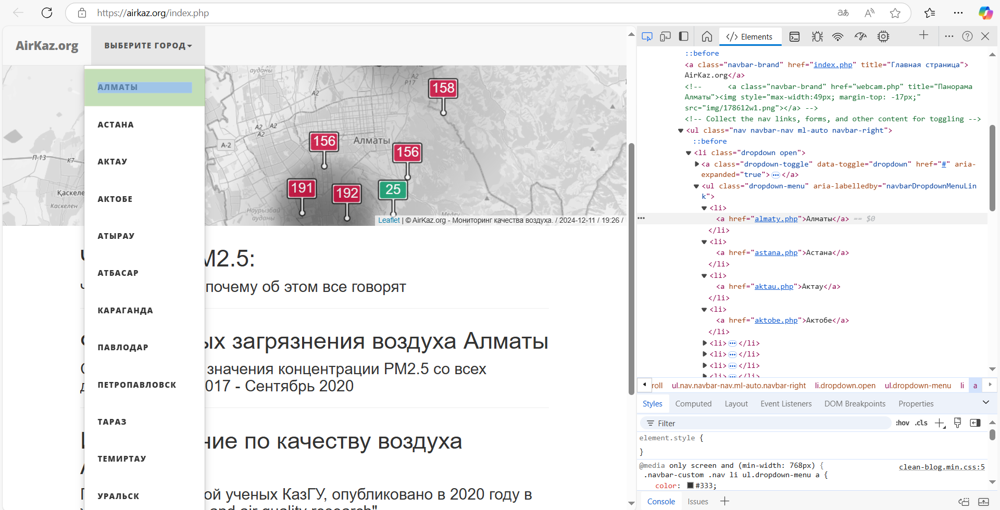
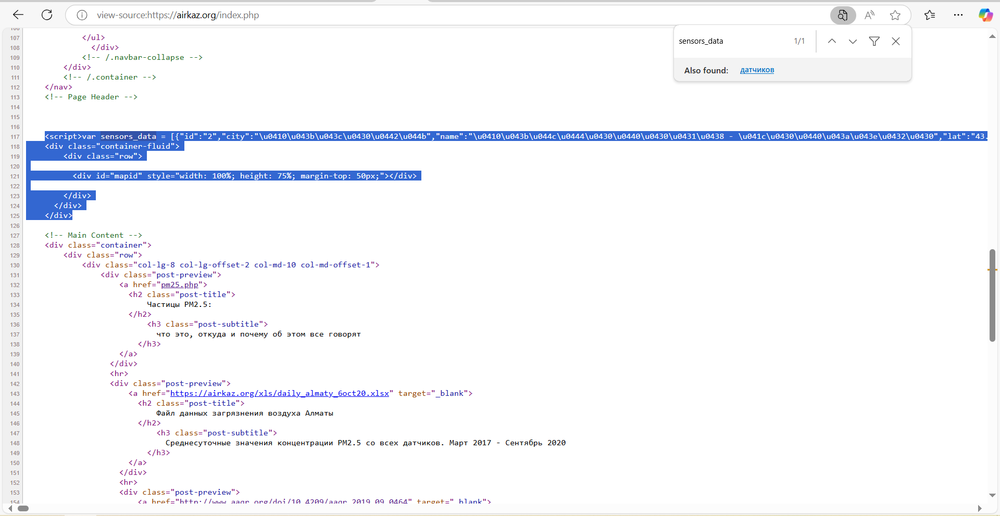

# task 1 - report
https://moodle.astanait.edu.kz/mod/assign/view.php?id=159786

## Requirements
- Collect dataset from the air polution website airkaz.org
  - for 3-5 days, should be automatically recorded in one .csv file
  - with step of each 1 hour between records
  - data from all Kazakhstan cities
  - be sure to specify data labels - city, time, date
- Use AI toolkits and record all requests and AI responses
- Create timeseries prediction / classification / clustering based on dataset

## Setup
- start redis: `docker compose up`
  - `redis-cli -h 127.0.0.1 -p 6379`
- start celery:
  - `celery -A tasks worker --loglevel=info -E`
  - `celery -A tasks beat`
  - `celery -A tasks flower --port=5001 --broker=redis://:my_password@127.0.0.1:6379/0 --broker_api=redis://:my_password@127.0.0.1:6379/0`

## Report
1. Изначально, была рассмотрена структура возвращаемых данных на сайте, чтобы понять как получить ссылки на все города. На изображении 1 показан ul список из элементов li с ссылками внутри тэга a. Для практики AI-assisted разработки, попросил у LLM вытянуть все ссылки и поместить в список. Также попросил сделать код для получения значения var sensors_data.
   - Application of AI: https://chatgpt.com/share/6759d539-ef60-800e-a878-f27b35ce9d60

2. Далее накидал уже сам связанный с запросами, сохранением данных, и переодическими задачами на celery beat (можно было также на apscheduler, cron и т.д. выполнить это).
3. 

## TODO
cross validation tables
ml algorithms
rate limiting
exceptions
retries
multiprocess / multithreding / async
transform date to datetime posix
redis.conf
