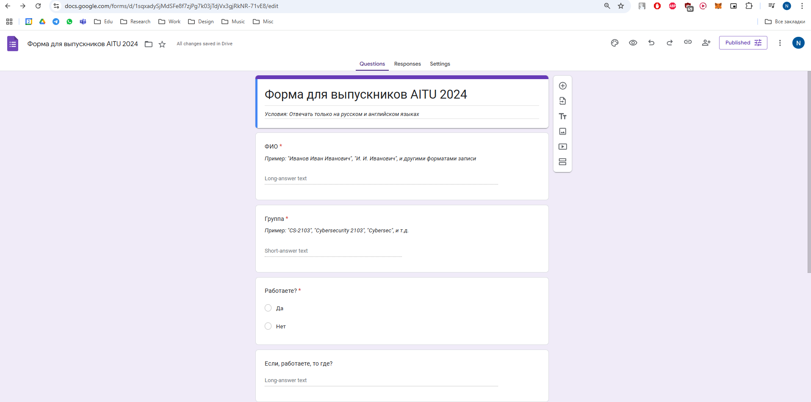
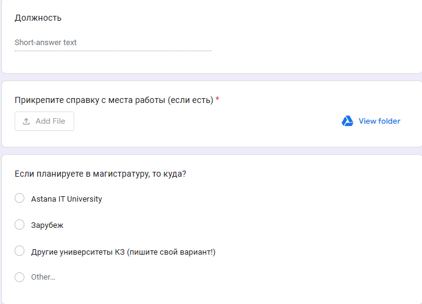

# Task 3 - Report

## Requirements
- https://moodle.astanait.edu.kz/mod/assign/view.php?id=161846
- Questionnaire processing system:
  - Purpose: Create a program that will automate the processing of survey results to speed up analysis and minimize errors.
  - Functionality:
    - Create a questionnaire (google form, other platforms, own website, etc.)
    - Recognize handwritten marks (checkboxes, numbers).
    - Analyze data and build graphs (histograms, pie charts).
    - Export results to Excel and PDF.
    - NLP analysis of responds (can write anything or MCQ), сделать графики и аналитику (count percents and group visualization).
  - Example case:
    - https://youtu.be/aoZBsJ0evTY
    - OpenCV or other analysis для того чтоб понять какими жестами удобнее управлять / ui for disable or invalid person.

## Solution
1. Был создан опросник на Google Forms:
   - Link for respondents: https://forms.gle/ofcJy2grPtMurMfJ6
   - 
   - 
2. Были выгружены ответы респондентов в excel формате в файле "form_responses.xlsx".
3. Установка зависимостей проекта:
  ```
  python3 -m venv venv
  source venv/bin/activate
  pip install -r requirements.txt
  `python3 -m nltk.downloader all` or just `popular`
  ```
  - Для векторизации данных и базового анализа были использованы библиотеки Pandas и Scikit-learn (для TF-IDF, T-SNE, PSA, etc.)
  - Для NLP (Natural Language Processing) была использована библиотека NLTK для ML (Machine Learning), у неё есть множество альтернатив в виде того же spaCy. Но есть ограничения, что данные библиотеки поддерживают ограниченный список языков. Для более сложных задач желательнее использовать DL (Deep Learning) подходы - той же архитектуры Transformers с библиотекой от Huggingface и т.д.
    - 
    - https://huggingface.co/docs/hub/en/models-downloading
    - git clone 
  
