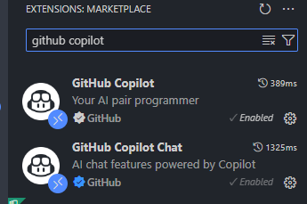
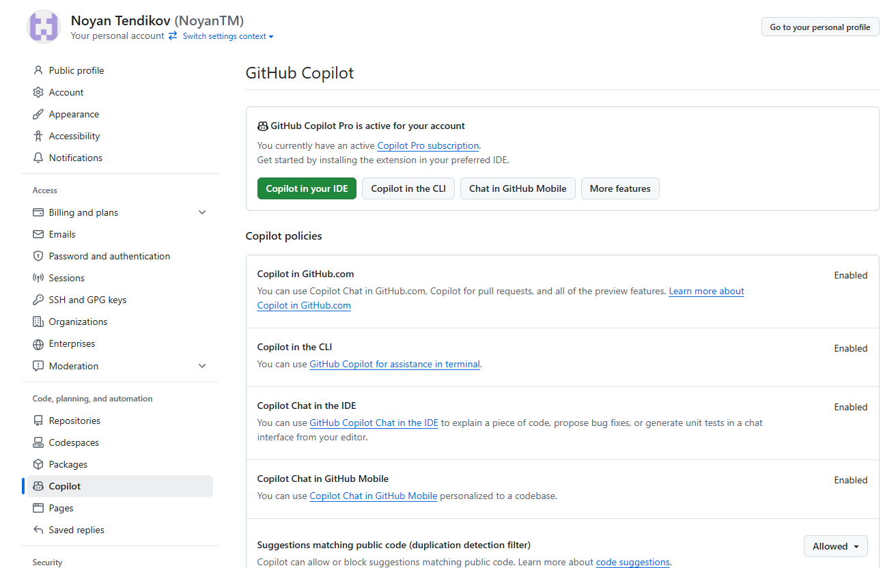
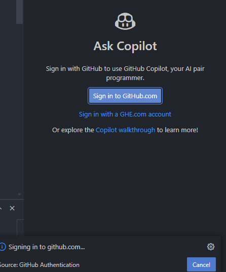
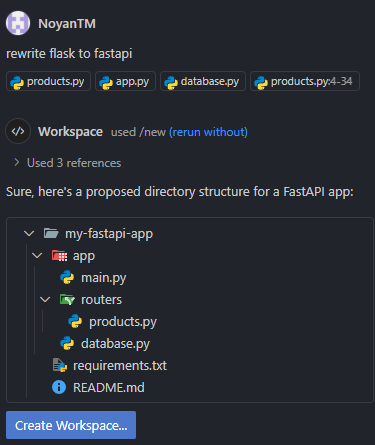
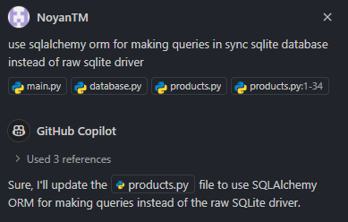

# Task 7 - Report

## Requirements
- https://moodle.astanait.edu.kz/mod/assign/view.php?id=163845
- Lecture materials and practices (from 11 to 21)

## Solution
### Installation for environment:
  - python3 -m venv venv
  - source venv/bin/activate
  - pip install -r requirements.txt

### Lecture 11 + 12 (DONE):
Data exploration for any further detailed statistical analysis and the development of machine learning models. We will work with the Amazon product review dataset, which includes a broad range of information reflecting consumer feedback and product evaluations.
Sentiment analysis of product reviews in positive and negative with Identification of most reviewed products from Amazon products dataset. Out of 37000 reviews, getting most reviewed products with number of reviews for each. Do a sentiment analysis on how many reviews are positive and negative based on ratings given by the user. Sentiment of reviews were not given beforehand in the dataset, so I took ratings in consideration and marked them Positive (>=3) and Negative (<3).

### Lecture 11 + Lecture 13 (DONE):
Building a Regression Model for Customer Spend with ChatGPT. In the realm of data-driven decision making, understanding customer behavior is pivotal for optimizing business strategies. Building on our exploration of classification techniques, this lecture shifts focus to regression analysis, specifically linear regression, to predict numerical values such as a customer’s annual spending. Linear regression helps us discover relationships within data, enabling predictions based on observed patterns.

### Lecture 14 (DONE):
Building an MLP (Multilayer Perceptron) Model for Fashion-MNIST. MLPs offer a rich framework for capturing intricate patterns and nonlinear dependencies, making them well suited for a wide range of predictive tasks.
  - Dataset - https://github.com/zalandoresearch/fashion-mnist
  - Guide - https://www.tensorflow.org/tutorials/keras/classification
  - Compare the model performance of a single layer versus two hidden layers, but with 20 and 50 epochs. Improvise a model by adding a dropout layer and analyze the impact on model performance. Feel free to add more hidden layers to the model.

### Lecture 15 (DONE):
Building CNN Model of the CIFAR-10 dataset with to Convolutional Neural Networks (CNNs).
  - Dataset - The CIFAR-10 dataset comprises 60,000 color images, divided into 10 classes, with 6,000 images per class. Each image has dimensions of 32x32 pixels and is represented in RGB format. The dataset is split into a training set of 50,000 images and a test set of 10,000 images.

### Lecture 16 (DONE):
Unsupervised learning with clustering and PCA (Principal component analysis) method. For instance, unsupervised learning models find patterns in unlabeled data. Clustering is a technique for finding groups of objects such that the objects in a group are like one another, yet objects in different groups are dissimilar.
  - Dataset - We will use the e-commerce dataset, which can be downloaded as a CSV file from the UCI Machine Learning Repository: https://archive.ics.uci.edu/dataset/352/online+retail. It contains data for all the transactions that occurred between 01/12/2010 and 09/12/2011 for a UK-based and registered non-store online retailer.

### Lecture 17 (DONE):
Machine Learning with Copilot. Machine learning, or ML, involves data and learning patterns from that said data and using those patterns to make predictions or decisions. Machine learning consists of a series of steps, all the way from loading data and cleaning it to eventually training a model to get the insights you need from said model. All these steps are roughly the same for most problems in this problem space. However, details may differ, like the choice of pre-processing step, the choice of algorithm, etc. An AI tool like GitHub Copilot comes into machine learning from a few different angles:

### Lecture 18 (DONE):
Regression and exploratory analysis for Apple’s (AAPL) stock data spanning 10 years to predict stock prices and help investors decide whether to buy or not.
  - Dataset - https://www.kaggle.com/datasets/tarunpaparaju/apple-aapl-historical-stock-data.
    - Data is collected and aggregated from 25 exchanges.
    - Data is updated weekly.
    - This dataset contains 1-minute, 5-minute, 30-minute, and 1-hour bars (open/high/low/close/volume) for AAPL.
    - Out-of-hours trades are included. Prices are adjusted for splits and dividends.
  - TAG (Task-Action-Guidance) prompt pattern / strategy.
    - Task: Regression analysis on Apple stock value through history
    - Action: We will need to instruct the AI assistant to tell us what steps to take
    - Guidance: The guidance should be us describing the dataset

### Lecture 19 (DONE):
Regression with Copilot Suggestions
  - Dataset - https://www.kaggle.com/datasets/varpit94/apple-stock-data-updated-till-22jun2021

### Lecture 20 (DONE):
Applying Github Copilot в IDE (for example VSCode or JetBrains) for code improving by adding documentation, tests, or maybe an ORM (object-relational mapper) by using commands covered in the lecture.
  - Github Copilot is used for [pair programming](https://en.wikipedia.org/wiki/Pair_programming) and [extreme programming](https://en.wikipedia.org/wiki/Extreme_programming), in which two or more engineers work together in one workstation in order to increase their efficiency. There are two roles: observer and driver (combination of strategy and tactics).
  - Github Copilot is free for [Github Student Pack](https://education.github.com/pack) subscription and can be downloaded as extension for VSCode.
    - 
    - 
    - 
    - 
    - 

What can Copilot help with?
  - It helps with productive worflow of the software engineer, because it reduce repetitive typing and refactoring (moving and editing of some files, not rewriting without developer). But it is only a helper, you need to think as you own and not trust this tool fully, due to hallucinations. It is not a silver bullet, it is only an assistant.
  - Code generation, automation, debugging, troubleshooting, code review, and optimization
  - Other usefull Copilot commands to improve workflow:
    - https://code.visualstudio.com/docs/copilot/overview
  - Also, snippets, refactoring, some shortcuts, and so on can be usefull developer productivity:
    - https://code.visualstudio.com/docs/getstarted/keybindings
    - https://code.visualstudio.com/docs/editor/userdefinedsnippets
    - https://code.visualstudio.com/docs/editor/refactoring
    - https://code.visualstudio.com/docs/getstarted/tips-and-tricks

### Lecture 21 (DONE):
Agents in Software Development. Agents are programs that can act on your behalf. They can perform tasks, make decisions, and interact with other agents and humans. Agents can be used in a wide range of applications.
