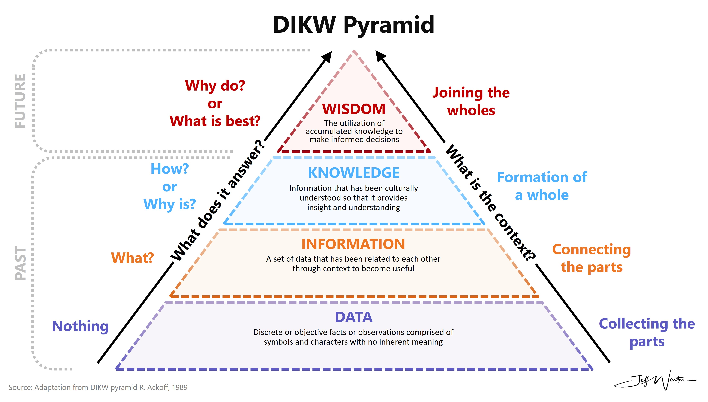

# Final Task - Report

## Requirements
- Develop final project with defense, report, and source code.
- Possible ideas: Algorithms for creating / managing schedule in university or work, Chess Bot, text message analysis for identifing inappropriate terms / lexicon, accounting for geographic data (cartographic roads, bus stops, timings and transport path analysis), attack detection system, image processing and upscaling, biometric authentication with deepfake attack prevention, real estate market analysis, recognition of hydraulic structures, image stabilization, human pattern recognition, natural speech processing and sythesis, etc.

## Solution
### Topic
Data and data-driven approach in the context of AI field

### Theoretical part

#### Data in AI
Data plays a significant role as an important resource similar to oil, serving as the foundation of any data science project, particularly in data-centric tasks (Pan et al., 2021). Its quality and volume have a direct influence on model performance. Therefore, the field of data science strives to solve data-driven problems. Its entire concept is build around the processing and application of data in the form of complex systems. Commonly, there are many misconceptions about data scientists, one of which is the belief that they must be multifaceted specialists in all areas of data science. Recently, this discipline has been distinctly divided into a combination of different directions: science (scientific competencies and research), domain (domain-specific and business expertise), development (software engineering and programming) (Natekin, 2018). As a result, the proportional distribution of these features shapes dynamic subclasses of data science professions such as ML engineer, data analyst, data engineer, MLOps, analyst, ML researcher, etc.



#### Data management
Generally, these tasks are commonly referred to data engineering and are required to develop effective procedures and pipelines around data. However, data engineering is often confused as big data which only refers to the scale of data and the corresponding toolkit required. It is commonly defined by 5 V's (volume, velocity, variety, veracity, value) and only represents a subset field within data science that focuses on data distribution and parallel processing (Martinez et al., 2021b; Munawar et al., 2022).

Technologies such as Hadoop and Apache Spark have transformed data storage and parallel processing, with the escalation in computational power, particularly from GPUs, while the increased scale of data exacerbates technology complexity, infrastructure requirements, and associated costs. For instance, certain articles claim that data engineering consists of several sub-stages (Faubel et al., 2023):
- Data collection involves multiple stages including data extraction, preparation, and transformation. Firstly, data extraction or gathering can utilize domain-related sources and multiple methods such as web scraping, querying records, and real-time sensors for data acquisition. Secondly, data preparation involves exploratory data analysis to understand data schemas and characteristics expected by the model. Finally, data engineers construct consistent pipelines for preliminary transformations, including cleaning and splitting into train, test, and validation datasets. However, throughout the process, there may arise risks about customer data, such as availability, sufficiency, processing time, and annotation quality (Martinez et al., 2021b). Therefore, a data assessment is necessary, evaluating processing complexity, sample object counts, domain-related patterns, annotation quality, and the handling of outliers or missing values. Additionally, experts recommend extending the data pool via creating variations of existing data through data augmentation or applying transfer learning (Testi et al., 2022).
- Data management serves as a supportive stage, facilitating tasks such as data labeling and versioning. Data labeling tools help data science teams in annotating large datasets, while data versioning tools assist both data science and engineering teams in managing model and dataset versions. These tools enable teams to gain insights into how data changes affect model performance and how datasets evolve over time. The processes described above are also known in some sources as ETL/ELT pipelines. ETL integration involves aggregating different final results in data warehouses while ensuring high data quality through professional tooling and step-by-step processing via streaming and batching data delivery. The main distinction between ETL and ELT lies in the stage at which transformation occurs. In ELT, data transformation is postponed until after loading unprocessed data, a process gaining popularity due to rapidly changing business requirements. 
- But from a cybersecurity standpoint, there are numerous concerns regarding data handling. For instance, data security and privacy management involves safeguarding information from denial-of-service attacks and unauthorized access or modification through authentication, authorization, data anonymization, and access tracking methods. Authentication typically involves usernames and passwords, limiting user data access, while access tracking logs details like dataset requests, data manipulation, and access validity. Data anonymization / obfuscation conceals sensitive data before user presentation, although merged data sources may potentially deanonymize information. Masked data must remain valid for system functions, such as postcode lookups, credit card checks, and Social Security Number validations.

#### Human and AI within domain
Specific domain tasks can be complex and diverse within specific business processes. Developing models in deep learning and machine learning requires a labeling process or its equivalent—assigning specific labels to objects, which the model then uses for training to analyze new objects and generate predictions. This process also includes dividing data into groups such as training, testing, and validation sets. However, pre-labeled datasets are not always available, and existing data may be of low quality. Without effective tools and methodologies, data labeling can be time-consuming, result in low-quality annotations, and raise challenges regarding the storage of original labels and post-training data, as well as model evaluation after deployment. Consequently, there is a need for stable processes, continuous improvement cycles, and well-structured pipelines. 

The data annotation process can be conducted based on the type of data source:
- Pre-existing Datasets / Data Generation – This approach utilizes publicly available open-source datasets or those from general domains. These datasets can be accessed online and used directly for various machine learning and data analysis tasks.
- Crowdsourcing and Outsourcing – Suitable for large-scale datasets involving relatively simple tasks, such as sentiment classification of social media reviews. Platforms and tools commonly used for such tasks include Toloka, Yandex Crowd, ABC Elementary, and Amazon Mechanical Turk.
- Internal Annotation within Organizations – This method is employed when handling sensitive or proprietary data. It is often necessary for tasks requiring domain-specific knowledge, such as chatbot message classification by topic or other complex annotations. Due to the nature of the data, a dedicated in-house team is typically required. Common tools for internal annotation include Excel, docanno, and Label Studio.

Stanford (2019) highlights the importance of Human-in-the-Loop (HITL) and Reinforcement Learning with Human Feedback (RLHF) as key approaches for aligning intelligent agents with human preferences. While human annotation remains central, pre-trained models can assist in labeling, resembling transfer learning and knowledge distillation, where a larger model aids in training a smaller one to enhance efficiency and performance. The quality of models is constrained by modeling errors and annotation errors. High-quality data annotation is essential, as models inherently learn from their training data, including any errors. For example, if only 60% of data is accurately labeled, achieving higher model accuracy is unrealistic. Any improvement beyond this threshold indicates overfitting to noise, leading to suboptimal generalization.

### Practical part
Geocoding and GIS data analysis with AI and address normalization / generation
1. [Geocoding](https://en.wikipedia.org/wiki/Address_geocoding) - task for converting or searching addresses or some title / name / description for specific location to the particular coordinates on the map. In the other hand, we have reverse geocoding, that does the opposite.
2. This task is highly related on the both NLP (Natural Language Processing) and vector / spatial data analysis.
3. In modern days, it could be solved with vast amount of toolkit and technologies: from LLM, SLM, just tokenizers, parsers, embeddings, etc.
4. Additionally, some examples with LabelStudio, NER, text data

Installation:
```
docker compose up
cat ./data/source_dump.sql | docker exec -i postgres_final psql -U postgres
- llama-cpp-python:
    - create seperate venv ```python3 -m venv venv_llama``` (because version of dependencies can cause some bugs with GPU acceleration)
    - install or reinstall with ```CMAKE_ARGS="-DLLAMA_CUDA=on" FORCE_CMAKE=1 pip install --upgrade --force-reinstall llama-cpp-python --no-cache-dir``` or ```CMAKE_ARGS="-DLLAMA_CUBLAS=on" FORCE_CMAKE=1 pip install --upgrade --force-reinstall llama-cpp-python --no-cache-dir```
    - for server api inference - ```pip install llama-cpp-python[server]```
    - run server api inference - ```python3 -m llama_cpp.server --config_file <config_file or config file path>```
```

### References (APA)
- Pan, I., Mason, L. R., & Matar, O. K. (2021). Data-centric Engineering: integrating simulation, machine learning and statistics. Challenges and opportunities. Chemical Engineering Science, 249, 117271. https://doi.org/10.1016/j.ces.2021.117271
- Natekin, A. (2018, October). Chem otlichayutsya data analyst, data engineer i data scientist. Yandex LLC. Retrieved Febr 21, 2024, from [https://events.yandex.ru/events/ds/21-oct-2018](https://events.yandex.ru/events/ds/21-oct-2018)
- Rowley, J. (2007). The wisdom hierarchy: representations of the DIKW hierarchy. Journal of Information Science, 33(2), 163–180. https://doi.org/10.1177/0165551506070706
- MIT. (n.d.). Data-Centric AI vs. Model-Centric AI. Introduction to Data-Centric AI. https://dcai.csail.mit.edu/2024/data-centric-model-centric/
- DeepLearningAI. (2021, March 24). A Chat with Andrew on MLOps: From Model-centric to Data-centric AI [Video]. YouTube. https://www.youtube.com/watch?v=06-AZXmwHjo
- Martinez, I., Viles, E., & Olaizola, I. G. (2021b). Data Science Methodologies: Current challenges and Future Approaches. Big Data Research, 24, 100183. https://doi.org/10.1016/j.bdr.2020.100183
- Munawar, H. S., Ullah, F., Qayyum, S., & Shahzad, D. (2022). Big data in construction: current applications and future opportunities. Big Data and Cognitive Computing, 6(1), 18. https://doi.org/10.3390/bdcc6010018
- Faubel, L., Schmid, K., & Eichelberger, H. (2023). MLOPs challenges in Industry 4.0. SN Computer Science, 4(6). https://doi.org/10.1007/s42979-023-02282-2
- Testi, M., Ballabio, M., Frontoni, E., Iannello, G., Moccia, S., Soda, P., & Vessio, G. (2022). MLOPs: A Taxonomy and a Methodology. IEEE Access, 10, 63606–63618. https://doi.org/10.1109/access.2022.3181730
- Stanford. (2019). Humans in the loop: The design of interactive AI systems. Stanford HAI. https://hai.stanford.edu/news/humans-loop-design-interactive-ai-systems
